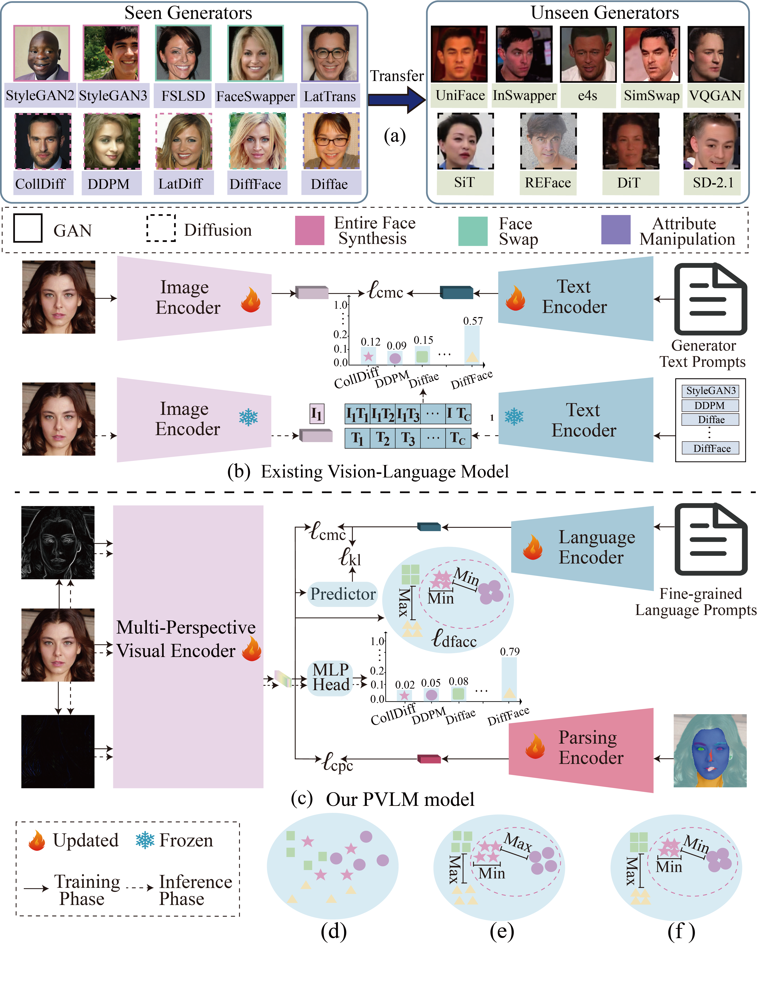

# PVLM: Parsing-Aware Vision-Language Model with Dynamic Contrastive Learning for Zero-Shot Deepfake Attribution
<div align="center">
  <a href="https://arxiv.org/abs/2409.09724">
    PVLM: Parsing-Aware Vision-Language Model with Dynamic Contrastive Learning for Zero-Shot Deepfake Attribution
  </a>
</div>

## Abstract
The challenge of tracing the source attribution of
forged faces has gained significant attention due to the rapid
advancement of generative models. However, existing deepfake
attribution (DFA) works primarily focus on the interaction
among various domains in vision modality, and other modalities
such as texts and face parsing are not fully explored. Besides,
they tend to fail to assess the generalization performance of
deepfake attributors to unseen advanced generators like diffusion
in a fine-grained manner. In this paper, we propose a novel
parsing-aware vision language model with dynamic contrastive
learning (PVLM) method for zero-shot deepfake attribution (ZSDFA), which facilitates effective and fine-grained traceability to
unseen advanced generators. Specifically, we conduct a novel
and fine-grained ZS-DFA benchmark to evaluate the attribution performance of deepfake attributors to unseen advanced
generators like diffusion. Besides, we propose an innovative
PVLM attributor based on the vision-language model to capture
general and diverse attribution features. We are motivated by
the observation that the preservation of source face attributes
in facial images generated by GAN and diffusion models varies
significantly. We propose to employ the inherent facial attributes
preservation differences to capture face parsing-aware forgery
representations. Therefore, we devise a novel parsing encoder
to focus on global face attribute embeddings, enabling parsingguided DFA representation learning via dynamic vision-parsing
matching. Additionally, we present a novel deepfake attribution
contrastive center loss to pull relevant generators closer and push
irrelevant ones away, which can be introduced into DFA models to enhance traceability. Experimental results show that our
model exceeds the state-of-the-art on the ZS-DFA benchmark via
various protocol evaluations.

## Overview

<p align="center">
  
</p>

## News
* **2026-06:** Codes of the PVLM model are released.


## Environmental requirements

- Python version：3.10.16  CUDA version: 11.7
- Dependent libraries：
  - torch=2.0.1+cu117
  - scikit-image=0.25.2
  - scikit-learn=1.6.1
  - scipy=1.15.2
  - tokenizers=0.13.3
  - torchvision=0.15.2+cu117
  - transformers=4.30.0
  - numpy=1.23.5
  - peft=0.4.0

## Install packages
```bash
git clone https://github.com/Jenine-321/PVLM.git
cd PVLM
conda create -n PVLM python=3.10.16
conda activate PVLM

conda install pytorch==2.0.1 torchvision==0.15.2 -c pytorch 

pip install -r requirements.txt
```


## Train


## Evaluate

## Citation
If you find this work useful for your research, please consider citing the following:
```bibtex
@ARTICLE{PVLM,
  author={Zhang, Yaning and Zhang, Jiahe and Ma, Chunjie and Guan, Weili and Gan, Tian and Gao, Zan},
  journal={IEEE Transactions on Dependable and Secure Computing}, 
  title={PVLM: Parsing-Aware Vision-Language Model With Dynamic Contrastive Learning for Zero-Shot Deepfake Attribution}, 
  year={2026},
  volume={},
  number={},
  pages={1-17},
  }


```
